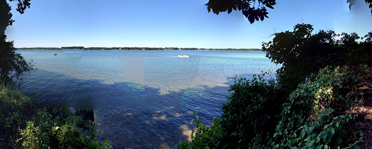

## Welcome to the EDAMAME course!

##### EDAMAME happened already for 2014, if you're interesting in being on our mailing list for EDAMAME 2015, [please provide us your name and email by going here](https://docs.google.com/forms/d/1aYhD6I9zE-eSKCNtYk-IOvodv5GDcQfX7mvBGQX7DfQ/viewform).

[For more about this course, see edamame-course.org](http://edamame-course.org).

##### Some of our links are set to download raw data or presentation files. If at any point you have an issue, just right click and open in another tab in your browser.

[Our Mendeley reading list is located here](http://www.mendeley.com/groups/4688421/edamame/). [PDF copies of readings can be found here](https://github.com/edamame-course/docs/tree/gh-pages/extra/PDFs)

[Our Etherpad is located here and is a shared note-taking space](https://edamame.etherpad.mozilla.org/1).

[Handouts from tutorials are here](https://github.com/edamame-course/docs/tree/gh-pages/extra/Handouts)

-------------------------------------------------------------------------------------

# Announcements

-------------------------------------------------------------------------------------

**Wednesday, August 13th, 2014**

[Wednesday, August 13th Overview](https://edamame-course.github.io/docs/august_13.html)

-------------------------------------------------------------------------------------

**Thursday, August 14th, 2014**

[Thursday, August 14th Overview](https://edamame-course.github.io/docs/august_14.html)

-------------------------------------------------------------------------------------

**Friday, August 15th, 2014**

[Friday, August 15th Overview](https://edamame-course.github.io/docs/august_15.html)

-------------------------------------------------------------------------------------

**Saturday, August 16th, 2014**  

[Saturday, August 16th Overview](https://edamame-course.github.io/docs/august_16.html)

-------------------------------------------------------------------------------------

**Sunday, August 17th, 2014**

[Sunday, August 17th Overview]() 

-------------------------------------------------------------------------------------

**Monday, August 18th, 2014**

[Monday, August 18th Overview](https://edamame-course.github.io/docs/august_18.html)

-------------------------------------------------------------------------------------

**Tuesday, August 19th, 2014**

[Tuesday, August 19th, Overview](https://edamame-course.github.io/docs/august_19.html)

-------------------------------------------------------------------------------------

**Wednesday, August 20th, 2014**

[Wednesday, August 20th Overview](https://edamame-course.github.io/docs/august_20.html)

-------------------------------------------------------------------------------------

